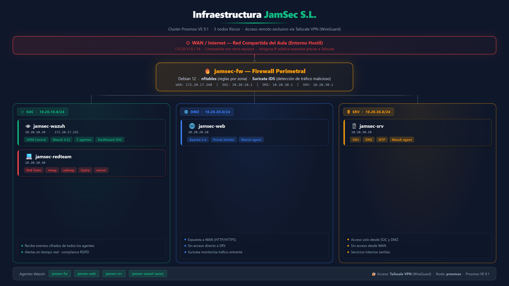
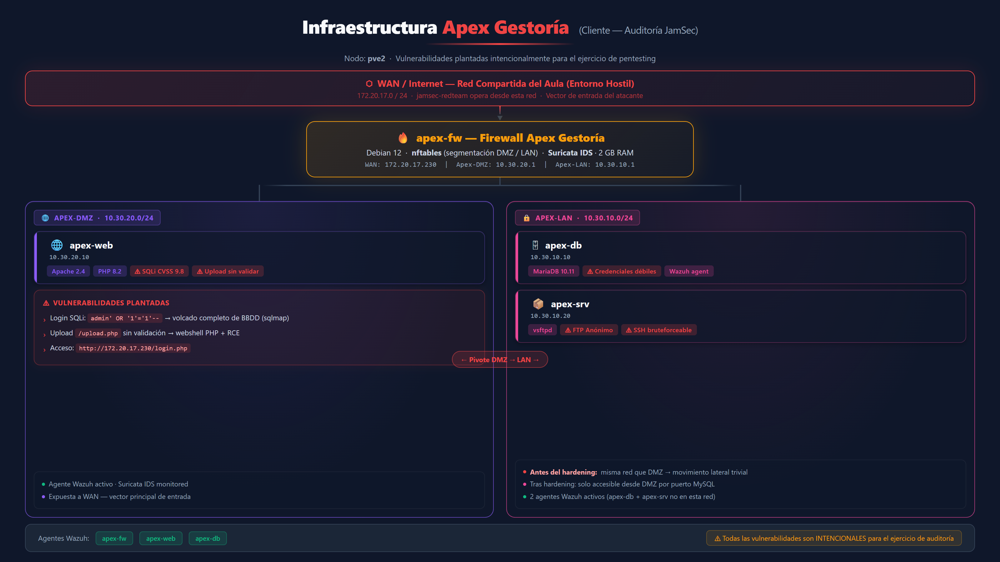

# JAMSEC — Auditoría y Defensa Tier-2

> Proyecto Final · Curso de Especialización en Ciberseguridad · Junio 2026  
> **Alumno:** Alex Sánchez García

---

## ¿Qué es este proyecto?

**JamSec S.L.** es una empresa de ciberseguridad ficticia creada para el proyecto final. El encargo: auditar y proteger a **Apex Gestoría**, una pyme con datos fiscales confidenciales y una infraestructura vulnerable.

El proyecto cubre tres disciplinas:

| Fase | Qué se hizo |
|------|-------------|
| 🔴 **Red Team** | Pentesting completo: SQLi, fuerza bruta SSH, FTP anónimo, pivote DMZ → LAN, webshell/RCE |
| 🟢 **Hardening** | Segmentación con nftables por zonas (WAN / DMZ / LAN / SOC) + Tailscale VPN |
| 🔵 **Blue Team / SOC** | Wazuh 4.12 SIEM con 7 agentes + Suricata IDS en ambos firewalls |

Todo corre sobre un **cluster Proxmox VE 9.1 real** (3 nodos físicos), no sobre simuladores.

---

## Infraestructura

### JamSec S.L.



### Apex Gestoría (cliente)



---

## Contenido del repositorio

```
📁 informes/
   ├── JAMSEC_Memoria_Proyecto.pdf                — Memoria completa del proyecto
   ├── JAMSEC_Informe_Tecnico_Auditoria_Apex.pdf  — Informe técnico PTES / OWASP Top 10
   └── JAMSEC_Informe_Ejecutivo_Auditoria_Apex.pdf — Informe ejecutivo para dirección

📁 presentacion/
   └── JAMSEC_Presentacion_Final.pptx             — Presentación del proyecto (13 diapositivas)

📁 imagenes/
   ├── JAMSEC_Infra_JamSec.png                    — Diagrama infraestructura JamSec S.L.
   └── JAMSEC_Infra_Apex.png                      — Diagrama infraestructura Apex Gestoría

📁 auditoria/evidencias/
   ├── 01-nmap-servicios.txt                      — Reconocimiento de puertos y servicios
   ├── 02-nikto.txt / 02-whatweb.txt              — Fingerprinting web
   ├── 03-sqlmap-dbs.txt                          — Enumeración de bases de datos (SQLi)
   ├── 04-sqlmap-dump.txt                         — Volcado completo de la BBDD de Apex
   ├── 05-ftp.txt                                 — Acceso FTP anónimo
   ├── 06-hydra-ssh.txt                           — Fuerza bruta SSH con Hydra
   └── auditoria-full.log                         — Log completo de la sesión de auditoría

📁 apex/web/
   ├── index.php                                  — Página de inicio Apex Gestoría
   ├── login.php                                  — Login (SQLi intencional para auditoría)
   └── panel.php                                  — Panel de empleados

📁 jamsec/web/
   └── index.html                                 — Web corporativa JamSec S.L.
```

---

## Vulnerabilidades auditadas en Apex Gestoría

| # | Vulnerabilidad | CVSS | Herramienta |
|---|---------------|------|-------------|
| 1 | Inyección SQL en login | **9.8 Crítico** | sqlmap |
| 2 | Subida de archivos sin validación → Webshell/RCE | **9.0 Crítico** | curl / netcat |
| 3 | Red plana — DMZ y LAN sin segmentar | **8.1 Alto** | nmap |
| 4 | FTP anónimo habilitado | **7.5 Alto** | ftp |
| 5 | SSH con contraseñas débiles | **7.5 Alto** | Hydra |
| 6 | Sin monitorización ni logging | **6.5 Medio** | — |

> ⚠️ Las vulnerabilidades en `apex/web/` son **intencionales** para el ejercicio de auditoría.

---

## Stack tecnológico

- **Hypervisor:** Proxmox VE 9.1 — 3 nodos físicos
- **SO VMs:** Debian 12 / Debian 13
- **Firewall:** nftables (reglas por zona en cada FW)
- **IDS:** Suricata 7 (modo detección, af-packet)
- **SIEM:** Wazuh 4.12 (manager + dashboard + 7 agentes)
- **VPN:** Tailscale (WireGuard) — acceso remoto sin IP pública
- **Web Apex:** Apache 2.4 + PHP 8.2 + MariaDB 10.11
- **Herramientas ofensivas:** nmap · sqlmap · Hydra · netcat · curl

---

## Metodología

- **Pentesting:** PTES (Penetration Testing Execution Standard)
- **Clasificación vuln.:** OWASP Top 10 (2021) + CVSS 3.1
- **Compliance:** RGPD — Art. 25 (privacidad por diseño) y Art. 32 (seguridad del tratamiento)

---

*Proyecto académico · Curso de Especialización en Ciberseguridad · 2025-2026*
